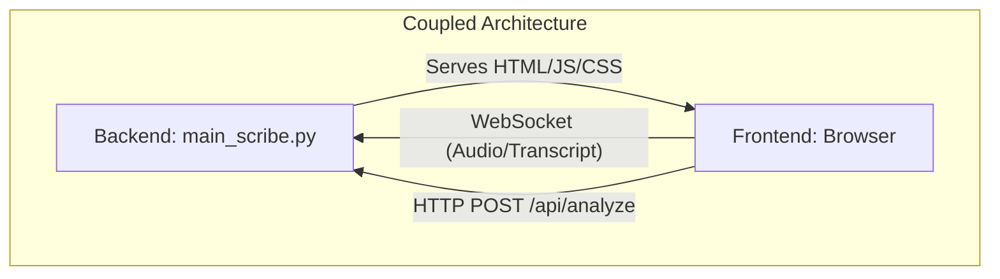
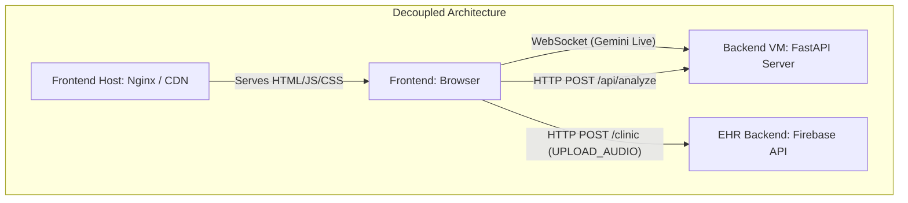
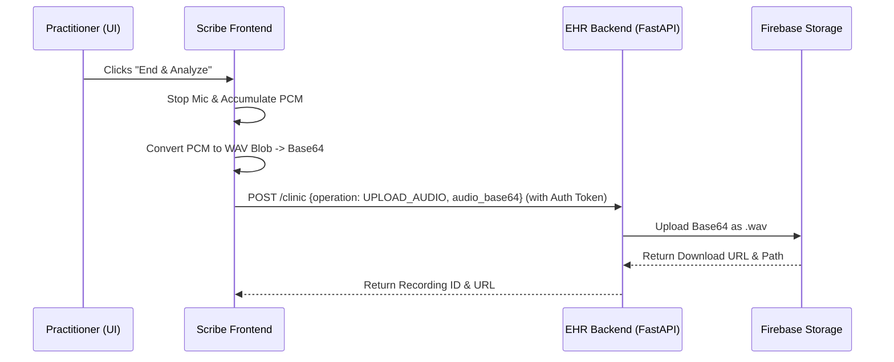

# Mute Scribe Decoupling & Integration Plan

This document outlines the strategy for decoupling the Mute Scribe frontend and backend, enabling Firebase Storage support, and integrating it into the main EHR platform.

---

## 1. Architecture Overview

### Current Architecture (Coupled)
Currently, `main_scribe.py` tightly couples the serving of static frontend files with the Gemini WebSocket and API routes.



### Proposed Architecture (Decoupled)
The frontend and backend will be hosted independently, creating a clear separation of concerns.



---

## 2. Incremental Implementation Steps

This implementation is broken down into distinct, verifiable steps. Complete each step fully before moving to the next.

### Step 1: Backend API Isolation
**Goal**: Transform `main_scribe.py` into a standalone API server that does not serve static files.

- [ ] **1.1. Remove Static Mounts**: Delete `app.mount("/static", ...)` and the `@app.get("/")` route serving `index.html` from `main_scribe.py`.
- [ ] **1.2. Update CORS**: Modify `CORSMiddleware` in `main_scribe.py` to allow origins for local development (e.g., `http://localhost:5173` or `http://127.0.0.1:5500`) and the future production frontend domain. Remove wildcard `["*"]` if possible.
- [ ] **1.3. Bind to All Interfaces**: Ensure `uvicorn.run(app, host="0.0.0.0", port=8000)` is set so the server accepts connections from external IP addresses.
- [ ] **1.4. Test Backend Independence**: Run `main_scribe.py` and verify you get a 404 on `/` but a successful connection to `/api/analyze` using curl/Postman.

### Step 2: Frontend Dynamic Configuration
**Goal**: Ensure the vanilla JS frontend can point to any remote server URL instead of relying on `window.location.host`.

- [ ] **2.1. Create Configuration**: Create a `config.js` file in the `frontend_scribe/` directory.
    ```javascript
    export const CONFIG = {
        SCRIBE_BACKEND_URL: "http://localhost:8000", // Update with Backend IP in prod
        EHR_BACKEND_URL: "http://localhost:8080"    // Update with EHR backend in prod
    };
    ```
- [ ] **2.2. Update WebSocket Connection**: In `gemini-client.js`, modify the WebSocket instantiation to parse `CONFIG.SCRIBE_BACKEND_URL` and convert `http://` to `ws://` dynamically.
- [ ] **2.3. Update API Calls**: In `main.js`, update the `fetch` call for `/api/analyze` to use `${CONFIG.SCRIBE_BACKEND_URL}/api/analyze`.
- [ ] **2.4. Test Frontend Independence**: Serve the `frontend_scribe/` folder using a simple static server (e.g., `python -m http.server 5500`). Open `http://localhost:5500` and verify the app can connect to the running backend on port 8000.

### Step 3: Implement Audio Capture and Conversion
**Goal**: Buffer the audio PCM stream on the frontend and convert it to a `.wav` file when recording stops.

- [ ] **3.1. Buffer PCM Chunks**: Modify `MediaHandler.js`. When audio data is captured and sent over the WebSocket, simultaneously push the raw PCM chunks into a local array `this.pcmChunks`.
- [ ] **3.2. WAV Conversion Logic**: Create a utility function (e.g., `pcmToWav(chunks, sampleRate)`) to stitch the PCM chunks together and prepend a standard WAV header. Return this as a `Blob`.
- [ ] **3.3. Base64 Encoding Utility**: Implement a helper standard function to convert the WAV `Blob` into a `base64` string asynchronously.
- [ ] **3.4. Test Local Conversion**: Add a temporary button to download the resulting `.wav` file locally to verify the audio plays correctly.

### Step 4: Firebase Storage Upload Integration
**Goal**: Upload the captured `.wav` file to the existing EHR backend.



- [ ] **4.1. Capture Context**: Ensure the Scribe frontend has access to `appointment_id` and `patient_id` (e.g., via URL params `?appointmentId=123`).
- [ ] **4.2. Upload Execution**: In the `analyzeBtn` click handler in `main.js`:
    - Await the WAV generation and Base64 conversion.
    - Make a `POST` request to `${CONFIG.EHR_BACKEND_URL}/clinic` with `operation: "UPLOAD_AUDIO"`.
    - Include the Authorization token (from `localStorage` or injected by EHR app).
- [ ] **4.3. Handle Response**: Parse the response to get the `recording_id`. Handle any 401/403 errors by alerting the user.
- [ ] **4.4. Test E2E Upload**: Complete a full recording session and verify the file appears in the `clinicstack-dev.firebasestorage.app` bucket.

### Step 5: Side-by-Side EHR Integration
**Goal**: Integrate the Scribe module into the main Vue.js/React EHR platform.

- [ ] **5.1. UI Entry Point**: Add a "Live Scribe Session" button to the Appointment Detail component in the main EHR frontend.
- [ ] **5.2. Routing**: Create a dedicated route for the Scribe module (e.g., `/scribe/:appointmentId`) or embed the HTML in an Iframe, passing the `appointmentId` and `patientId` as query parameters.
- [ ] **5.3. Auth Sharing**: Ensure the user's JWT token is passed to the Scribe module. If using a dedicated route in a SPA, they automatically share the same `localStorage`. If using an iframe, pass it securely or rely on shared domain cookies.
- [ ] **5.4. Data Hand-off**: Once `/api/analyze` returns the structured SOAP/Observation data, emit an event or update a shared store so the EHR's "Clinical Notes" form is automatically populated.
- [ ] **5.5. Final Integration Testing**: Run the complete EHR application, open an appointment, launch Scribe, dictate, and ensure notes are extracted and audio is saved to Firebase.

---

## 3. Verification Roadmap

Before declaring the integration complete, verify the following checklist:

- [ ] Static assets and Python API run on different ports/servers.
- [ ] WebSocket proxying (if applicable) or direct IP connections establish without CORS/WSS errors.
- [ ] Ending the session successfully converts PCM to a downloadable WAV format.
- [ ] Audio files reliably appear in the target Firebase Storage bucket under the correct `appointment_id`.
- [ ] Transcription JSON automatically maps onto the required inputs within the EHR Appointment view.
