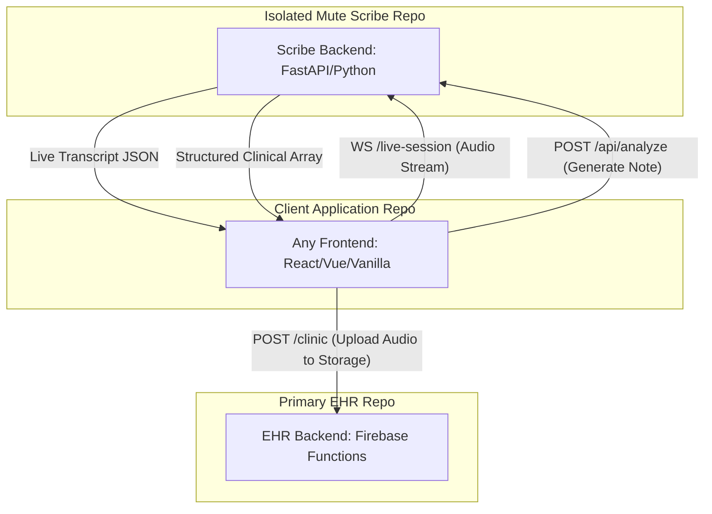

# Isolated Mute Scribe Backend Architecture & Integration Plan

This document outlines the strategy for extracting the Mute Scribe backend into a completely independent, agnostic microservice, separate from the primary EHR `backend/functions`. 

---

## 1. Architecture Overview (Isolated Microservice)

The Scribe Backend will be extracted into a **separate Git repository**. It will function as a standalone, headless microservice that any frontend application can integrate with. It will purely handle the Gemini Live WebSocket proxying and the prompt-based transcript analysis, leaving business logic (like Firebase Storage and database persistence) to the client application or main EHR backend.



---

## 2. API Specifications & Usage

This standalone backend will expose two primary endpoints.

### 2.1. WebSocket Endpoint: Real-time Audio & Transcription
**Endpoint:** `ws://<SCRIBE_BACKEND_URL>/ws/gemini-live`

**Purpose**: Establishes a bi-directional stream with Gemini. The client sends base64 PCM audio; the API returns live transcription chunks.

**Client-to-Server Payload (Client sending audio):**
```json
{
  "realtimeInput": {
    "mediaChunks": [
      {
        "mimeType": "audio/pcm;rate=16000",
        "data": "<BASE64_ENCODED_AUDIO_CHUNK>"
      }
    ]
  }
}
```

**Server-to-Client Payload (Server returning transcript):**
```json
{
  "serverContent": {
    "modelTurn": {
      "parts": [
        { "text": "Patient is presenting with..." }
      ]
    }
  }
}
```

### 2.2. REST Endpoint: Final Transcript Analysis
**Endpoint:** `POST http://<SCRIBE_BACKEND_URL>/api/analyze`

**Purpose**: Takes the full recorded string of raw transcript (collected during the WS session) and uses Gemini to structure it into a JSON clinical format (SOAP, etc).

**Request Body (`application/json`):**
```json
{
  "transcript": "Patient is presenting with headache for 3 days. Prescribed Paracetamol 500mg twice a day.",
  "system_instructions": "Optional custom prompt. Default schema used if omitted."
}
```

**Response (`application/json`):**
```json
{
  "success": true,
  "analysis": {
    "vitals": {},
    "diagnosis": ["Headache"],
    "medications": [
      { "name": "Paracetamol", "dosage": "500mg", "frequency": "BID" }
    ],
    "plan": "Follow up if symptoms persist."
  }
}
```

---

## 3. Implementation Plan: Creating the Isolated Repo

### Step 1: Initialize the New Repository
- Create a new Git repository named `mute-scribe-api`.
- Copy `main_scribe.py` to the new repo and rename it to `app/main.py`.
- Remove all static mounts (`app.mount("/static")`) and HTML templates since this is now a pure headless API.

### Step 2: Configure Environment and Dependencies
- Create a `requirements.txt` containing FastAPI, Uvicorn, WebSockets, and `google-genai`.
- Create a `.env.example` mapping properties like:
  ```env
  GEMINI_API_KEY=your_key_here
  GEMINI_MODEL=gemini-3.1-flash-live-preview
  CORS_ORIGINS="*" # Configurable for prod
  ```

### Step 3: Implement CORS & Security
- Add standard `CORSMiddleware` in `app/main.py` driven by the `CORS_ORIGINS` environment variable, ensuring the frontend (wherever it is hosted) is not blocked by the browser's security policies.

---

## 4. Frontend Integration Guide (How to Use)

Since this API is completely agnostic, any frontend (Vanilla JS, Vue EHR frontend, etc.) can implement this flow:

### Phase A: Setup and Connection
1. In your frontend application, define the microservice URLs based on your environment:
    ```javascript
    const SCRIBE_API_URL = "http://your-scribe-repo-domain.com";
    const SCRIBE_WS_URL = "ws://your-scribe-repo-domain.com";
    ```

### Phase B: Streaming the Session
1. Use the browser's `AudioContext` or `MediaRecorder` to record microphone audio at 16kHz PCM.
2. Open a WebSocket connection to `${SCRIBE_WS_URL}/ws/gemini-live`.
3. Read audio chunks from your microphone, convert to Base64, and send them through the WebSocket using the specified `realtimeInput` JSON format.
4. Listen for incoming `serverContent` messages on the WebSocket and concatenate the incoming `text` fields into a single `fullTranscript` local variable. 
5. Simultaneously, push the raw audio PCM chunks into a local storage array or array of `Blob(s)` for later saving.

### Phase C: Analysis & Upload
1. When the user clicks "End Session", close the WebSocket connection.
2. Call the REST API to structure the final text:
   ```javascript
   const aiResponse = await fetch(`${SCRIBE_API_URL}/api/analyze`, {
       method: "POST",
       headers: { "Content-Type": "application/json" },
       body: JSON.stringify({ transcript: fullTranscript })
   });
   const structuredData = await aiResponse.json();
   ```
3. Auto-populate your frontend form fields (e.g. Vitals, Medications, Diagnosis) using the fields from `structuredData`.
4. Take the buffered audio, wrap it into a single `.wav` file locally, convert it to Base64, and dispatch a POST call to your **primary EHR backend** (e.g., `backend/functions/clinic` endpoint with action `UPLOAD_AUDIO`) to securely store the session recording in Firebase Storage using established auth mechanisms.

By following this guide, the `mute-scribe-api` remains conceptually clean, completely containing ZERO Firebase or EHR-specific business logic, allowing it to be scaled, tested, or redeployed entirely via its own separate git repository.
